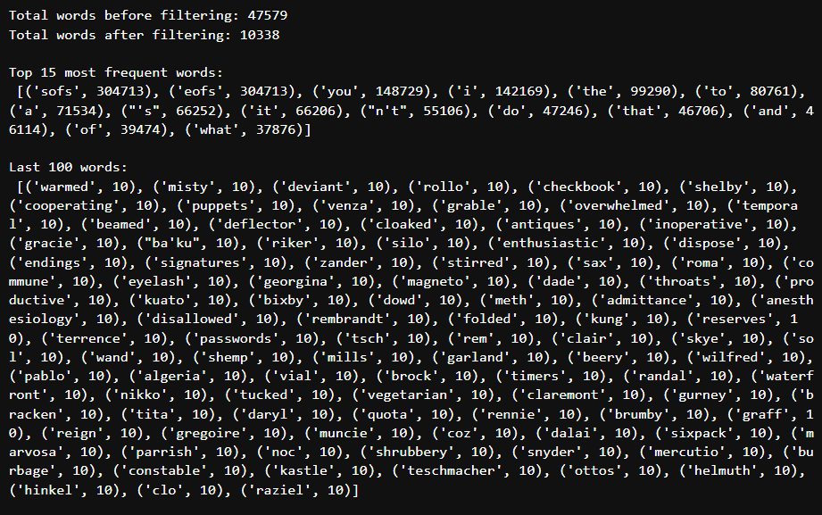
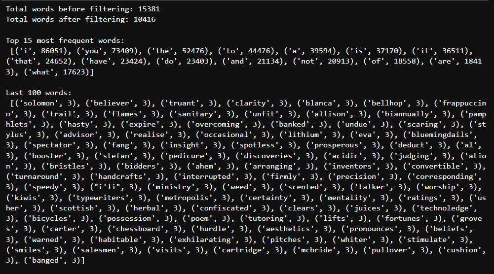
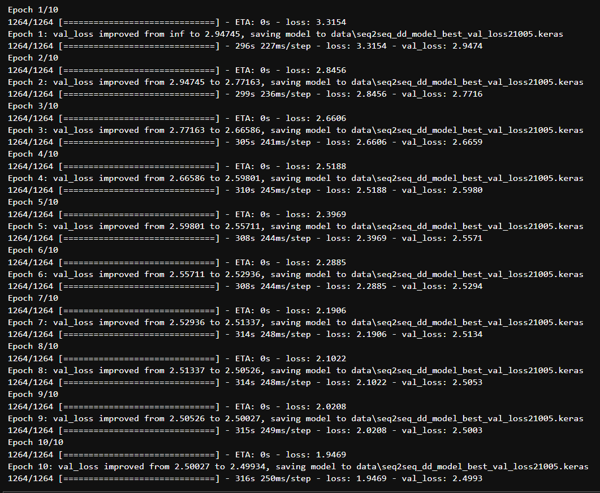
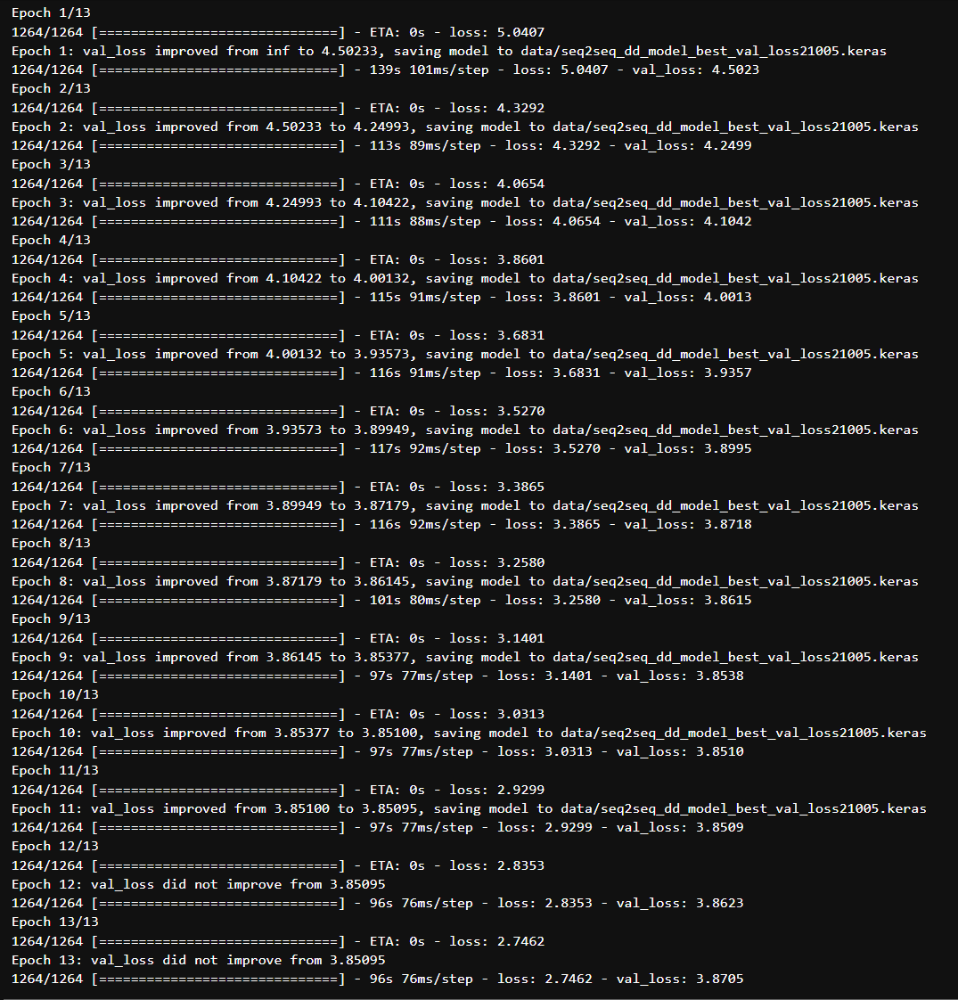
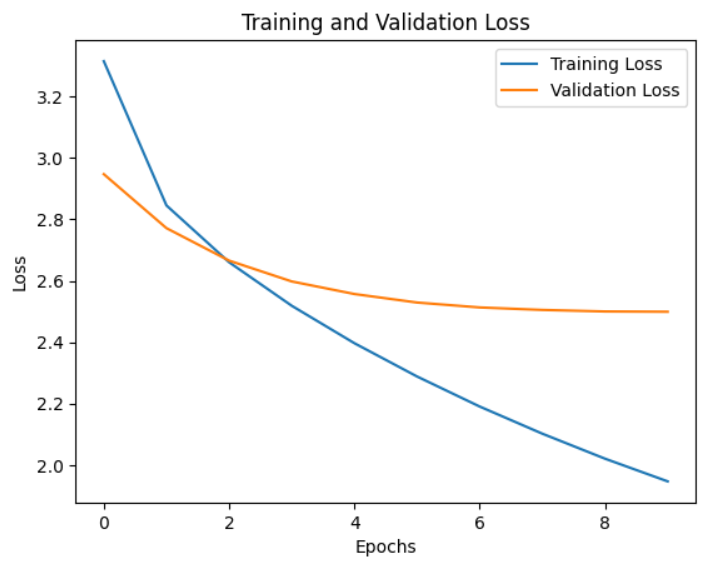
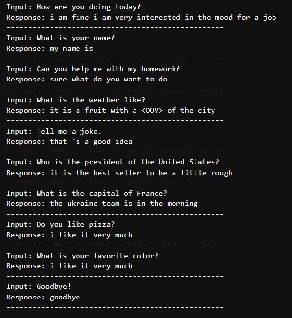
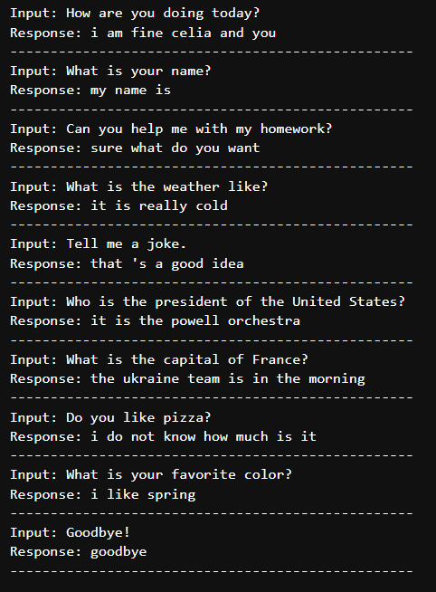

# Project Name: Chatbot Conversation Generator

## Introduction

This project aims to develop a chatbot conversation generator using Python and Keras. The project encompasses several
key components:

1. **Data Preprocessing**: Cleaning and preparing the dataset to be used for training the chatbot model.
2. **Model Development**: Creating a seq2seq bidirectional encoder-decoder model to generate responses.
3. **Chatbot Application**: Developing a real-time Python chatbot application utilizing the trained model, with
a custom GUI built using `customtkinter`.
4. **Project Delivery**: Deploying the entire project on GitHub for accessibility and collaboration.

The main objective is to create a functional and interactive chatbot capable of generating coherent and contextually
appropriate responses. This involves both the technical aspects of machine learning model training and the practical
aspects of GUI application development.

In the following sections, I will detail each component of the project, starting from data preprocessing, moving
through model development, and finally to the implementation of the chatbot application and its deployment on GitHub.

## Data

### Cornell Movie-Dialogs Corpus

The project began with the Cornell Movie-Dialogs Corpus, a large metadata-rich collection of fictional conversations
extracted from raw movie scripts. This dataset includes:

- **220,579** conversational exchanges
- **10,292** pairs of movie characters
- **617** movies

The corpus provides a substantial foundation for training conversational models due to its diversity in dialogues
and characters.

**Data Sources:**
- [Cornell Movie-Dialogs Corpus Documentation](https://convokit.cornell.edu/documentation/movie.html)
- [Chameleons in Imagined Conversations](https://www.cs.cornell.edu/~cristian/Chameleons_in_imagined_conversations.html)

### DailyDialog

Subsequently, the project transitioned to using the DailyDialog dataset. This dataset is notable for its high quality
and multi-turn dialog structure. Key features of the DailyDialog dataset include:

- **13,118** dialogues in total
- **11,118** dialogues in the training set
- **1,000** dialogues in the validation set
- **1,000** dialogues in the test set
- On average, around **8 speaker turns** per dialogue
- Approximately **15 tokens** per turn

The dataset is human-written, resulting in less noise compared to other datasets. The dialogues reflect daily
communication, covering a variety of everyday topics. Additionally, the dataset is manually labeled with communication
intention and emotion information, providing valuable context for training dialog systems.

**Source:**
- [DailyDialog Dataset on Hugging Face](https://huggingface.co/datasets/daily_dialog/tree/refs%2Fconvert%2Fparquet/default)

## Data Preprocessing

### Cornell Movie-Dialogs Corpus

#### Data Structure and Organization

```plaintext
data/
└── movie_corpus/
    ├── conversations.json
    ├── corpus.json
    ├── index.json
    ├── speakers.json
    └── utterances.jsonl
```
Description [here](https://convokit.cornell.edu/documentation/movie.html).

#### Choice for Exploration
The `utterances.jsonl` file is essential as it contains dialogue data. This file will be used to train the chatbot
to understand and generate responses.

#### Utterance Information
Each utterance includes:
- **id**: index
- **speaker**: author
- **conversation_id**: conversation identifier
- **reply_to**: previous utterance id (None if not a reply)
- **timestamp**: time
- **text**: content

#### Decision on Data
Only data from `utterances.jsonl` is used. Essential elements:
- **text**: for responses
- **conversation_id**: for conversation flow
- **reply_to**: for sequence understanding

#### Converting to DataFrame
Pandas is used for data manipulation, filtering, and analysis.

#### Data Cleaning
Keep necessary fields: `id`, `conversation_id`, `reply_to`, and `text`.

#### Conclusion
The dataset is clean and well-structured. Each conversation is correctly linked and formatted.

After pairing inputs with responses, 221,616 entries were obtained for training. However, due to issues with the
vocabulary — specifically, the presence of a large amount of slang and uncommon words within the last 10,000 entries
of a 47,000-word dictionary, making it particularly dirty — a cleaner dataset was chosen.
This decision was driven by the need for more consistent and reliable language data to improve the chatbot's
performance and accuracy in generating human-like responses. <br>


### DailyDialog

#### Clean Data
For the first such project I will use only dialogues, without additional data like 'act' and 'emotion'. I will use
my own data split, therefore I will concatinate all data and take only dialogs. After pairing, 89,861 rows with
a cleaner vocabulary were obtained.



### Text Normalization and Preprocessing

To prepare the dialogue data for model training and response generation, several preprocessing
steps are implemented. These steps ensure the text data is clean, consistent, and suitable for
training a chatbot model.

#### Contraction Handling

A dictionary of common contractions is used to expand contractions into their full forms.
This ensures consistency in the dataset by standardizing different forms of common words.

#### Text Normalization

I've decided perform several key tasks:
- Convert the Unicode text to ASCII and removes non-ASCII characters.
- Convert all text to lowercase to maintain uniformity.
- Add spaces around punctuation marks to ensure they are treated as separate tokens.
- Replace contractions using the predefined dictionary.
- Remove any characters that are not letters, basic punctuation, or spaces.
- Collapse multiple whitespace characters into a single space and trim leading/trailing spaces.

#### Removing Names

I've chosed utilize spaCy's Named Entity Recognition (NER) to remove names from the text. This
step helps in anonymizing the data and focusing on the conversational content rather than
specific entities. That is time consuming process (~20 min.).

#### Trimming Text

The text is also trimmed to a specified maximum length to ensure uniform input size for the model.
This step is doubled later with padding. If remove trimming, the whole length of dialogue sentences will 
be used for training.

## Pairing Dialogues

To create meaningful input-response pairs for training the chatbot, each sentence in a dialogue
is paired with the subsequent sentence. This helps in maintaining the conversational context, as
each sentence is treated as a reaction to the previous one.  
By choosing to pair dialog sequences in this manner, each sentence is directly linked to its
preceding sentence, preserving the flow of conversation and ensuring that the model learns to
generate contextually appropriate responses.

## Tokenization

To prepare the text data for model training, tokenization is a crucial step. Tokenization
involves converting text into sequences of tokens (numerical representations) that the model
can process. The sequence of steps in tokenization is critical:

1. **Create Vocabulary - Initialize the Tokenizer**: Create a tokenizer with a specified
vocabulary size and an out-of-vocabulary (OOV) token. Fit the tokenizer on both input and
response text data to learn the word index.
2. **Add Special Tokens**: Incorporate `<START>`, `<END>`, and `<OOV>` tokens into the vocabulary.
3. **Convert Text to Sequences**: Transform text data into token sequences.
4. **Prepare Encoder Input**: Do not add `<START>` and `<END>` tokens to encoder input data.
5. **Prepare Decoder Input**: Add the `<START>` token to decoder input data.
6. **Prepare Decoder Output**: Add the `<END>` token to decoder output data.

This structured approach ensures that the text data is appropriately tokenized and formatted
for model training, enhancing the chatbot's ability to generate coherent and contextually
appropriate responses.

### Schema of the Process

```plaintext
Input and Output Text
  |
  V
Fit Tokenizer (Create Vocabulary)
  |
  +--> Add Special Tokens to Vocabulary (<START>, <END>, <OOV>)
  |
  V
Convert Text to Sequences
  |
  +--> Encoder Input:
  |      Tokenize and Pad Sequences
  |
  +--> Decoder Input:
  |      Tokenize -> Add <START> Token -> Pad Sequences
  |
  +--> Decoder Output:
         Tokenize -> Add <END> Token -> Pad Sequences
```
I found that the Keras tokenizer in default mode removes punctuation and additional tags like
 `<START>` or `|start|`, therefore it is not recommended to add these before initialization.

## Splitting the Data for Training and Validation

To train the chatbot model effectively, it is crucial to split the data into training and 
validation sets. This helps in monitoring the model's performance and detecting overfitting.
There are two primary ways to achieve this:

1. **Using Scikit-Learn**: The `train_test_split` function from scikit-learn can be used to
split the data into training and validation sets. This method allows specifying the test size
and ensures reproducibility by setting a random state.

2. **Within the Fit Method**: Alternatively, the data can be split within the `fit` method of
the model. By specifying a `validation_split` parameter, a portion of the data is reserved 
for validation during training. This approach is simpler and integrates directly into
the training process.

For this project, test data was not used as it was deemed unnecessary. However, validation
data is essential to monitor the model's performance and detect overfitting. Therefore, a
validation split was incorporated into the model training process.

## Summary of Preprocessing

Preprocessing is a critical step in preparing data for training a chatbot model. Each step must be meticulously
checked to ensure the integrity and quality of the data. The model is highly sensitive to the input data, and
even small errors can lead to unsatisfactory outputs. It is essential to be confident that the data fed into the
model is accurate and clean, as this will significantly impact the model's performance. Without rigorous
preprocessing, diagnosing issues with the model's output becomes nearly impossible, underscoring the importance
of this phase in the development process.

## Model Architecture

The model architecture for the chatbot is designed based on a seq2seq (sequence-to-sequence) approach, utilizing a bidirectional LSTM (Long Short-Term Memory) network for the encoder and a unidirectional LSTM for the decoder. Here are the detailed steps and components of the model:

1. **Model Parameters**:
   - `latent_dim`: The dimensionality of the latent space used in the model. This determines the size of the hidden states in the LSTM layers.
   - `num_encoder_tokens` and `num_decoder_tokens`: The number of unique tokens (words) in the input and output vocabularies, respectively.
   - `learning_rate`: The learning rate for the optimizer.

2. **Encoder**:
   - **Inputs**: The encoder receives input sequences.
   - **Embedding Layer**: Converts input tokens into dense vectors of fixed size (`latent_dim`), making it easier for the model to learn.
   - **Bidirectional LSTM**: Processes the input sequence in both forward and backward directions, capturing dependencies from both ends of the sequence. The output consists of hidden and cell states from both directions.
   - **Concatenation of States**: The hidden and cell states from the forward and backward LSTMs are concatenated to form the final encoder states.

3. **Decoder**:
   - **Inputs**: The decoder receives the target sequences (shifted by one timestep).
   - **Embedding Layer**: Converts target tokens into dense vectors of size matching the concatenated encoder states.
   - **LSTM**: Processes the embedded target sequences using the initial states from the encoder, generating a sequence of output vectors.
   - **Dense Layer**: Applies a dense (fully connected) layer with a softmax activation function to predict the next token in the sequence for each timestep.

4. **Model Definition**:
   - The model is defined to take both the encoder inputs and the decoder inputs, producing the decoder outputs.

5. **Compilation**:
   - The model is compiled using the Adam optimizer with a specified learning rate and the sparse categorical crossentropy loss function.

6. **Checkpoint Callback**:
   - A model checkpoint is defined to save the best model based on validation loss during training.

### Schema of the Model

```plaintext
Encoder:
  - Input: Sequence of tokens
  - Embedding Layer: Converts tokens to dense vectors
  - Bidirectional LSTM: Processes sequence in both directions
  - Concatenation: Combines forward and backward states

Decoder:
  - Input: Target sequence of tokens
  - Embedding Layer: Converts tokens to dense vectors
  - LSTM: Processes embedded target sequence with encoder states
  - Dense Layer: Predicts next token in sequence

Model:
  - Inputs: Encoder input sequence, Decoder input sequence
  - Outputs: Decoder output sequence

Compilation:
  - Optimizer: Adam
  - Loss Function: Sparse categorical crossentropy

Training:
  - Model checkpoint to save the best model based on validation loss
```

## Training the Model

The model was developed and trained in a specific environment to utilize GPU compatibility on an older PC. Here are the details of the training environment and important observations:

### Training Environment

- **Python Version**: 3.10.14
- **TensorFlow Version**: 2.10.0
- **TensorFlow Keras Version**: 2.10.0

This setup was chosen to ensure compatibility with the available hardware and to take advantage of GPU acceleration for faster training.

### Training Process

The model was trained using the following configuration:
- **Input Data**: The model takes both encoder input sequences and decoder input sequences.
- **Output Data**: The model predicts the next token in the sequence for each timestep.
- **Batch Size**: 128
- **Epochs**: 4
- **Validation Split**: 0.1 (10% of the data is used for validation to monitor the model's performance and detect overfitting)
- **Optimizer**: Adam with a learning rate of 0.001
- **Loss Function**: Sparse categorical crossentropy

### Important Observations

An important observation during the training process was the difference in loss and validation loss metrics when using different versions of TensorFlow. Specifically, the loss and validation loss values were observed to differ when training on the following setup:
- **Python Version**: 3.10.14
- **TensorFlow Version**: 2.10.0
- **TensorFlow Keras Version**: 2.10.0

and following setup:
- **Python Version**: 3.10.12
- **TensorFlow Version**: 2.15.0

This indicates that the version of TensorFlow can impact the model's training performance and the resulting metrics. Therefore, for consistent results, it is recommended to use the specified versions mentioned above.

### Model Training Summary

The model was successfully trained and the training process completed with the defined parameters. Below is a summary of the model architecture and training configuration:

```plaintext
Model Summary:
- Encoder: Bidirectional LSTM with latent dimension of 200 (concatenated to 400)
- Decoder: LSTM with Dense layer for predictions
- Embedding Layers: Both encoder and decoder have embedding layers with mask_zero=True
- Optimizer: Adam
- Learning Rate: 0.001
- Loss Function: Sparse categorical crossentropy
- Batch Size: 64
- Epochs: 10
- Validation Split: 10%
- Dropout: 0.2 in both encoder and decoder LSTM layers
- Checkpoint: Save the best model based on validation loss

Training Environment:
- Python: 3.10.14
- TensorFlow: 2.10.0
- TensorFlow Keras: 2.10.0
```
  
I tried a lower learning rate, recurrent dropout, kernel_regularizer l2, different batch sizes, and other
architectures, but these experiments resulted in requiring more epochs and producing less accurate results.

## Response Generation

To generate responses from the trained model, two methods were used: `argmax` and beam search. Each method has its
strengths and provides different results under various conditions.

### Argmax

The `argmax` method selects the token with the highest probability at each step in the sequence generation process.
This approach is straightforward and efficient but may not always produce the most contextually accurate responses.

**Process**:
1. Encode the input sequence to get the internal states.
2. Generate an empty target sequence initialized with the start token.
3. Iteratively predict the next token until the end token is reached or the maximum sequence length is exceeded.
4. Append the predicted token to the response and update the target sequence and states.
5. Return the decoded sentence, removing start and end tokens.

### Beam Search

Beam search is a more sophisticated decoding method that keeps track of multiple potential sequences (beams) at each
step, expanding the most promising beams. This approach can produce more contextually accurate responses but is
computationally more intensive.

**Process**:
1. Encode the input sequence to get the internal states.
2. Initialize beams with the start token and the initial states.
3. For each step up to the maximum sequence length:
    - Expand each beam by predicting the next token.
    - Keep the top `beam_width` beams based on cumulative probability.
    - If all beams end with the end token, stop the process.
4. Choose the best beam with the highest score as the final output.
5. Return the decoded sentence, removing start and end tokens.

### Observations

- **Argmax**: This method consistently generates responses but may lack context sensitivity, leading to less
accurate answers in some cases.
- **Beam Search**: This method can produce different responses for the same input, sometimes more accurate and
contextually appropriate.

### Examples of Testing Conversations

Here are two examples of testing conversations, showcasing the differences between `argmax` and beam search:

**Argmax Example**:  <br>


**Beam Search Example**: <br>


These examples illustrate how beam search can provide more nuanced and contextually relevant responses compared
to the `argmax` method.

## Saving and Loading the Model

During the development of the chatbot, various methods for saving and loading the model were explored.
The journey involved dealing with file sizes, compatibility issues, and ensuring consistent behavior during
response generation.

### Initial Approach: Saving the Entire Model

With TensorFlow 2.10.0, the model was initially saved in `.H5` or `.keras` formats, which save the entire model
architecture, weights, and training configuration. While this method preserves everything required to reload and 
use the model seamlessly, it presented several challenges:

- **Inconsistent Behavior**: Loading the saved model resulted in different behavior during response generation,
making it unreliable.
- **File Size**: The saved model file was 203 MB, exceeding GitHub's single file size limit of 100 MB.
This posed problems for delivery and simplicity.

### Effective Approach: Saving Only Weights

A more effective approach was found by saving only the model weights. This method involved compiling the model
anew when reusing it and then loading the saved weights. The advantages of this approach include:

- **Consistency**: Loading weights into a freshly compiled model consistently produced reliable results during
response generation.
- **File Size**: The size of the saved weights was only 68 MB, well within GitHub's file size limit, making
it more manageable for delivery and storage.

## Application Development

### Initial Steps

The application development process began by extracting all necessary components from the model development
notebook into a separate notebook. This included:

- Preprocessing functions
- Tokenizer
- Model and weights
- Response generation functions

### Building the UI

1. **Coding a Simple UI**:
    - A simple user interface (UI) was developed to facilitate interaction with the model.
    - The initial UI was coded directly in the notebook to ensure the chatbot functionality worked as expected.

2. **Exporting to a Python File**:
    - Once the basic chatbot functionality was verified in the notebook, the notebook was exported to a `.py` file.
    - This transition enabled further development in an integrated development environment (IDE) for better code
   management and development practices.

### Further Development in PyCharm

1. **Setting Up a Clean Virtual Environment**:
    - A separate, clean virtual environment was created in PyCharm to ensure all dependencies were managed properly
   and to avoid conflicts with other projects.

2. **Code Cleaning and Production Readiness**:
    - The code was cleaned and refactored to make it production-ready.
    - Any redundant or extraneous code was removed, and the structure was optimized for performance and maintainability.

3. **Enhancing the GUI with customtkinter**:
    - The GUI was further developed using `customtkinter` to provide a more polished and user-friendly interface.
    - Sample interactions were added to the GUI to demonstrate the chatbot's capabilities and facilitate user testing.
