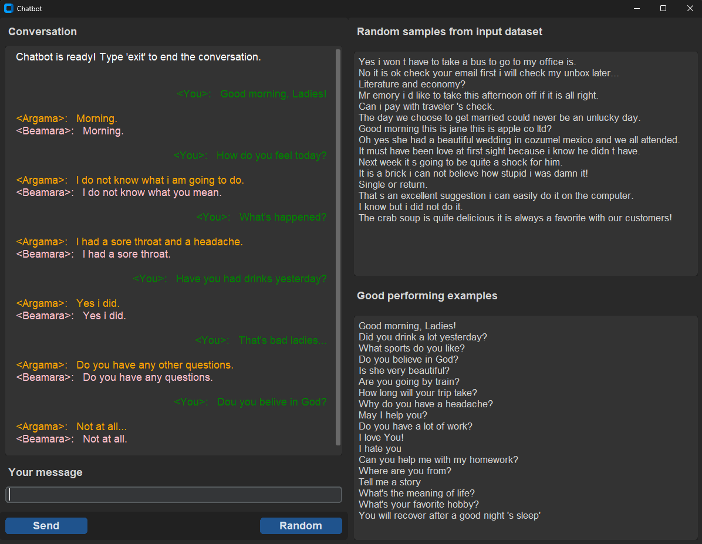

# Interactive Chatbot Application

## Overview

The main objective of this project was to create a functional and interactive chatbot capable of generating coherent
and contextually appropriate responses. This involves both the technical aspects of machine learning model training
and the practical aspects of GUI application development.

## Project Components

1. `development.ipynb` - **Data processing**: Exploratory Data Analysis, data preprocessing and model development in Jupyter Lab notebook.
2. `chatbot_app.ipynb` - **Chatbot application development**: Development and testing in a Jupyter Lab notebook.
3. `chatbot_app.py` - **Conversion to a standalone Python script**: Fully working GUI chatbot application.
4. `samples/` - **Sample notebooks**: Used for initial stages of preprocessing, training of different models, and in different environments.
5. `requirements.txt` - **Dependencies**: Lists all the Python packages and their versions required to run Chatbot application.
6. `DEVELOPMENT_PAPER.md` - **Development documentation**: Detailed description of the development process and any relevant findings.


## Key Features

- Uses a sequence-to-sequence bidirectional encoder-decoder Keras model to generate conversations.
- Responses are generated with two different functions: argmax and beam search.
- Runs on a customtkinter-based GUI with a conversation display field, input field, and two fields of samples
for easy input testing.

## Requirements

- **Python Version**: 3.10.11-14
- **TensorFlow Version**: 2.10.0
- **TensorFlow Keras Version**: 2.10.0


## Installation Instructions

Follow these steps to set up the application locally:

1. **Ensure you have Python 3.10 installed** on your system (this is important, because TensorFlow 2.10.0 is
available to download only with Python 3.10). You can download Python 3.10 from [Python's official website](https://www.python.org/downloads/).
2. **Download the project** from its [GitHub repository](https://github.com/Tomas4python/chatbot) and extract it into a new folder or use GIT to clone the project:
   - Open **Command Prompt** or **PowerShell**.
   - Navigate to the project folder:
     ```
     cd path\to\project\folder
     ```
   - Clone the project:
     ```
     git clone "https://github.com/Tomas4python/chatbot.git"
     ```

3. **Set Up a Virtual Environment**:
   - Navigate to the 'chatbot' folder:
     ```
     cd path\to\project\folder\chatbot
     ```
   - Create a new virtual environment named `venv`:
     ```
     python -m venv venv
     ```
   - Activate the virtual environment:
     ```
     .\venv\Scripts\activate
     ```

4. **Install Dependencies**:
   - In activated virtual environment (venv) navigate to 'chatbot' folder:
     ```
     cd path\to\project\folder\chatbot
     ```
   - Install all required dependencies:
     ```
     pip install -r requirements.txt
     ```

By following these steps, you'll have a clean and isolated Python environment for running and testing Chatbot App.

## Launching the Application

Navigate to the project folder and activate the virtual environment. Run the application by executing:
```
python chatbot_app.py
```

## Using Notebooks

If you prefer using the notebooks as originally created and used (trained), you should run them in the
following environment:
- **Python Version**: 3.10.14
- **TensorFlow Version**: 2.10.0
- **TensorFlow Keras Version**: 2.10.0

These notebooks also run in Google Colab.

To set up a Jupyter Lab or Jupyter Notebook environment in Anaconda, create a new environment using the
following commands in Anaconda Command Promt or Power Shell:
```
conda create -n py310_tf210 python=3.10
conda activate py310_tf210
conda install -c conda-forge cudatoolkit=11.2 cudnn=8.1.0 # Choose this if you have cuda driver installed
python -m pip install chardet charset_normalizer
python -m pip install "tensorflow==2.10"
python -m pip install pyarrow
python -m pip install fastparquet
python -m pip install scikit-learn
python -m pip install matplotlib
python -m pip install nltk
python -m pip install spacy
python -m spacy download en_core_web_sm
```
After successful installation go to Anaconda Navigator, choose py310_tf210 environment
and choose Jupyter Lab or Jupyter Notebook which one you appreciate more.
This installation ensures the possibility of using the GPU, if you have NVIDIA GPU and CUDA drivers installed.
How to install CUDA - google for "CUDA Installation Guide" and "CUDA Toolkit Downloads".

## Usage

The application is self-intuitive and has a familiar look to other chatbots. Enter a message in the input field and press 'Enter' or click the 'Send' button. The chatbot will respond accordingly. Additionally, there are fields on the right for pre-prepared text input samples. You can press the 'Random' button to get a random sample in the input field. To exit, type 'exit' or close the window.

### Screenshot

Below is a screenshot of the app GUI window in action:



---

